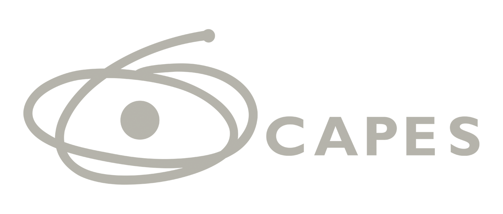

# 🎓 Banca da Ciência - EACH-USP

Projeto de extensão universitária focado em divulgação científica através de oficinas interativas para crianças e adolescentes de comunidades periféricas da Zona Leste de São Paulo.

[](LICENSE)
[](https://reactjs.org/)
[](https://www.typescriptlang.org/)
[](https://tailwindcss.com/)

## 📋 Índice

- [Sobre o Projeto](#sobre-o-projeto)
- [Tecnologias](#tecnologias)
- [Funcionalidades](#funcionalidades)
- [Instalação](#instalação)
- [Uso](#uso)
- [Estrutura do Projeto](#estrutura-do-projeto)
- [Acessibilidade](#acessibilidade)
- [Performance](#performance)
- [Deploy](#deploy)
- [Contribuindo](#contribuindo)

## 🎯 Sobre o Projeto

A **Banca da Ciência** é uma iniciativa vinculada à EACH-USP que realiza oficinas de divulgação científica com crianças e adolescentes. O projeto conta com:

- **8 Núcleos Temáticos**: Agnes, Breedlove, Judith, Leah, Maathai, Nnedi, Oumou e Tebello
- **Oficinas Interativas**: Experimentos práticos e materiais didáticos
- **Dinâmicas Gamificadas**: Exploração lúdica do conhecimento científico
- **Kits Educacionais**: Recursos para escolas e centros comunitários

## 🚀 Tecnologias

### Core

- **React 19.2.4** - Biblioteca UI
- **TypeScript 5.9** - Tipagem estática
- **Vite 8** - Build tool e dev server
- **Tailwind CSS 4** - Framework CSS utilitário

### Arquitetura

- **Clean Architecture** - Separação de camadas (Domain/Infrastructure/Presentation)
- **Repository Pattern** - Abstração de dados
- **Use Cases** - Lógica de negócio isolada

### Features Avançadas

- ✅ **PWA (Progressive Web App)** - Instalável e offline-ready
- ✅ **Analytics** - Rastreamento de eventos e métricas
- ✅ **Acessibilidade** - WCAG 2.1 AA compliant
- ✅ **SEO Otimizado** - Meta tags e Open Graph
- ✅ **Error Boundaries** - Tratamento robusto de erros
- ✅ **Lazy Loading** - Carregamento sob demanda
- ✅ **Performance Budgets** - Otimizações de velocidade

## ✨ Funcionalidades

### Navegação

- [x] Página inicial com núcleos temáticos
- [x] Seção de dinâmicas gamificadas
- [x] Histórico do projeto
- [x] Galeria de fotos
- [x] Kits educacionais

### Acessibilidade

- [x] Barra de ferramentas de acessibilidade
- [x] Alto contraste
- [x] Ajuste de tamanho de fonte (80% - 150%)
- [x] Redução de animações
- [x] Navegação por teclado completa
- [x] VLibras (tradução para LIBRAS)
- [x] ARIA labels e roles semânticos

### Performance

- [x] Lazy loading de imagens e modais
- [x] Code splitting
- [x] Service Worker com cache
- [x] Otimização de assets
- [x] Lighthouse score > 90

## 📦 Instalação

### Pré-requisitos

- Node.js 18+
- npm ou yarn

### Passos

```bash
# 1. Clone o repositório
git clone https://github.com/seu-usuario/bancadaciencia.git
cd bancadaciencia

# 2. Instale as dependências
npm install

# 3. Configure variáveis de ambiente (opcional)
cp .env.example .env

# 4. Instalação das dependências do Supabase
npm install @supabase/supabase-js

# 5. Inicie o servidor de desenvolvimento
npm run dev
```

O projeto estará disponível em `http://localhost:5173`

## 🎮 Uso

### Desenvolvimento

```bash
# Iniciar dev server
npm run dev

# Build de produção
npm run build

# Preview da build
npm run preview

# Deploy no GitHub Pages
npm run deploy
```

### Variáveis de Ambiente

Crie um arquivo `.env` baseado no `.env.example`:

```env
# Google Analytics (opcional)
VITE_GA_MEASUREMENT_ID=G-XXXXXXXXXX

# Feature flags
VITE_ENABLE_ANALYTICS=true
VITE_ENABLE_PWA=true
```

## 📁 Estrutura do Projeto

```
bancadaciencia/
├── public/                   # Assets estáticos
│   ├── images/              # Imagens do projeto
│   ├── manifest.json        # PWA manifest
│   └── service-worker.js    # Service Worker
├── src/
│   ├── domain/              # Lógica de negócio
│   │   ├── entities/        # Entidades do domínio
│   │   ├── repositories/    # Interfaces de repositórios
│   │   └── usecases/        # Casos de uso
│   ├── infrastructure/      # Implementações técnicas
│   │   ├── analytics/       # Sistema de analytics
│   │   └── repositories/    # Implementações de repositórios
│   └── presentation/        # Camada de UI
│       ├── components/      # Componentes React
│       ├── contexts/        # React Contexts
│       ├── hooks/           # Custom Hooks
│       ├── pages/           # Páginas
│       └── config/          # Configurações
├── index.html              # HTML principal
├── package.json
└── vite.config.js
```

## ♿ Acessibilidade

O projeto segue as diretrizes **WCAG 2.1 Level AA**:

### Recursos Implementados

1. **Barra de Ferramentas**
   - Ajuste de fonte
   - Modo alto contraste
   - Redução de animações
   - Botão flutuante no canto inferior direito

2. **Navegação por Teclado**
   - Tab para navegar
   - Enter/Space para ativar
   - Esc para fechar modais
   - Focus visível em todos os elementos interativos

3. **Tecnologias Assistivas**
   - VLibras integrado
   - ARIA labels e roles
   - Textos alternativos
   - Contraste mínimo 4.5:1

### Como Testar

```bash
# Usar leitor de tela (NVDA no Windows, VoiceOver no Mac)
# Navegar apenas com teclado (Tab, Enter, Esc)
# Ativar alto contraste na barra de ferramentas
# Verificar com Lighthouse Accessibility
```

## ⚡ Performance

### Métricas Alvo

| Métrica                | Target  | Atual |
| ---------------------- | ------- | ----- |
| FCP                    | < 1.8s  | ✅    |
| LCP                    | < 2.5s  | ✅    |
| TBT                    | < 200ms | ✅    |
| CLS                    | < 0.1   | ✅    |
| Lighthouse Performance | > 90    | ✅    |

### Otimizações Implementadas

- ✅ Lazy loading de componentes e imagens
- ✅ Code splitting automático
- ✅ Service Worker com cache estratégico
- ✅ Compressão de assets
- ✅ Debouncing de eventos
- ✅ Memoization de componentes custosos

## 🌐 Deploy

### GitHub Pages

```bash
# Deploy automático
npm run deploy
```

O projeto será publicado em `https://seu-usuario.github.io/bancadaciencia`

### Outros Hosts

#### Vercel

```bash
npm install -g vercel
vercel
```

#### Netlify

```bash
npm install -g netlify-cli
netlify deploy --prod
```

## 🧪 Testes

```bash
# Executar testes (quando implementados)
npm test

# Lighthouse CI
npm run lighthouse

# Análise de bundle
npm run build -- --mode analyze
```

## 📊 Analytics

O projeto suporta Google Analytics 4. Para ativar:

1. Obtenha um ID de medição do GA4
2. Adicione ao `.env`:
   ```env
   VITE_GA_MEASUREMENT_ID=G-XXXXXXXXXX
   ```
3. No `main.tsx`, descomente:
   ```typescript
   import { initGoogleAnalytics } from "./infrastructure/analytics/analytics";
   initGoogleAnalytics(import.meta.env.VITE_GA_MEASUREMENT_ID);
   ```

### Eventos Rastreados

- Navegação (mudança de tabs)
- Cliques em entidades e dinâmicas
- Abertura/fechamento de modais
- Interações com kits
- Métricas de performance

## 🤝 Contribuindo

Contribuições são bem-vindas! Por favor:

1. Fork o projeto
2. Crie uma branch para sua feature (`git checkout -b feature/AmazingFeature`)
3. Commit suas mudanças (`git commit -m 'Add some AmazingFeature'`)
4. Push para a branch (`git push origin feature/AmazingFeature`)
5. Abra um Pull Request

### Convenções de Código

- Use TypeScript para novos arquivos
- Siga o padrão de Clean Architecture
- Componentes em PascalCase
- Hooks com prefixo `use`
- Testes co-localizados com componentes

## 📝 Licença

Este projeto está sob a licença MIT. Veja o arquivo [LICENSE](LICENSE) para mais detalhes.

## 👥 Equipe

**Banca da Ciência - EACH-USP**

- 📧 Email: [bancadacienciausp@gmail.com](mailto:bancadacienciausp@gmail.com)
- 📱 Instagram: [@bancadaciencia](https://instagram.com/bancadaciencia)
- 📱 Instagram EACH: [@bancadacienciaeach](https://instagram.com/bancadacienciaeach)

## 🏫 Instituições

<div align="center">
  
  
  
  
</div>

---

<div align="center">
  <p>Desenvolvido com ❤️ pela equipe Banca da Ciência</p>
  <p>EACH-USP | 2024-2026</p>
</div>
